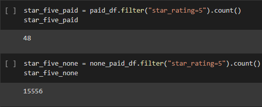
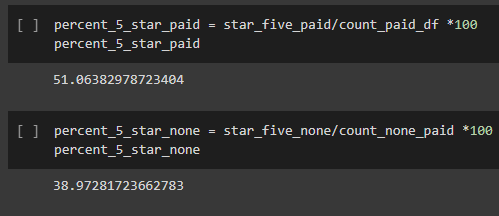

# Amazon Vine

## Overview: 
We wanted to take a deep dive and see if there is any bias toward favorable reviews from Vine members in the Amazon video game dataset, as opposed to none Vine members.  

## Results:
### Vine and None Vine review totals
  - As seen in the image below there when we focus only on reviews with 20 or more total votes we get 94 total Vine reviews and 39915 None Vine reviews.
  
  
 
  
### Vine reviews and none vine reviews that have 5 start ratings
  - About half of the vine reviews were 5 stars, and 15,556 of the none vine reviews were 5 star.

  
  
 ### Percentage of 5 star ratings by Vine and Non-Vine reviews
  - The Vine 5 star reviews made up 51% of the population (those with 20 or more total votes), and Non-Vine 5 start reviews we 40% of the Non-Vine population. 

  

## Summary: 
There does seem to be a tendency the vine reviews to get a higher rate of 5 start reviews, but there is just not enough data to give a concrete answer.
