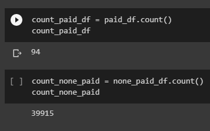

# Amazon Vine

## Overview: 
We wanted to take a deep dive and see if there is any bias toward favorable reviews from Vine members in the Amazon video game dataset, as opposed to none Vine memebers.  

## Results:
### Vine and None Vine reveiw totals
  - As seen in the image below there when we focus only on reviews with 20 or more total votes we get 94 total Vine reveiws and 39915 None Vine reveiws.
  
  
 
  
### Vine reviews and none vine reviews that have 5 start ratings
  - The total amount of employees eligable for mentorship is 1549.

  

  - Review of those that are eligiable for the mentorship show the highest numbers for Senior Staff and Engineers.

  

## Summary: 
### How many roles will need to be filled as the "silver tsunami" begins to make an impact?
-  Just over 72,000 employees are set to leave the company over the next few years.    

### Are there enough qualified, retirement-ready employees in the departments to mentor the next generation of Pewlett Hackard employees?
- Yes! We have a rich pool of employees we year of experience to share in the develomplent of those ready to be mentored. Below is a list of job types and the number of employees that fall out of the ready to retire and eligable for mentorship buckets. 

### Overall View
- In the below images creaeted with a new query (overall_view) we can see the nubmers of who is retiring, who could be mentors, and those that are eligable to be mentored. Though we are losing a large number of Senior Engineers, we have a large amount of Engineers that have the possibilty of being promoted! 

